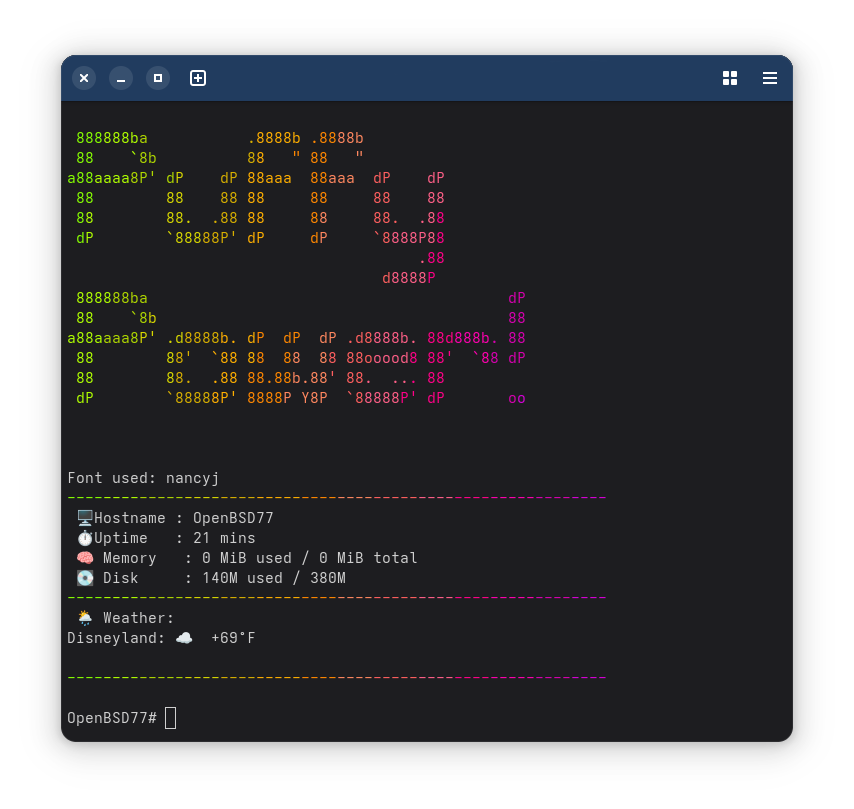
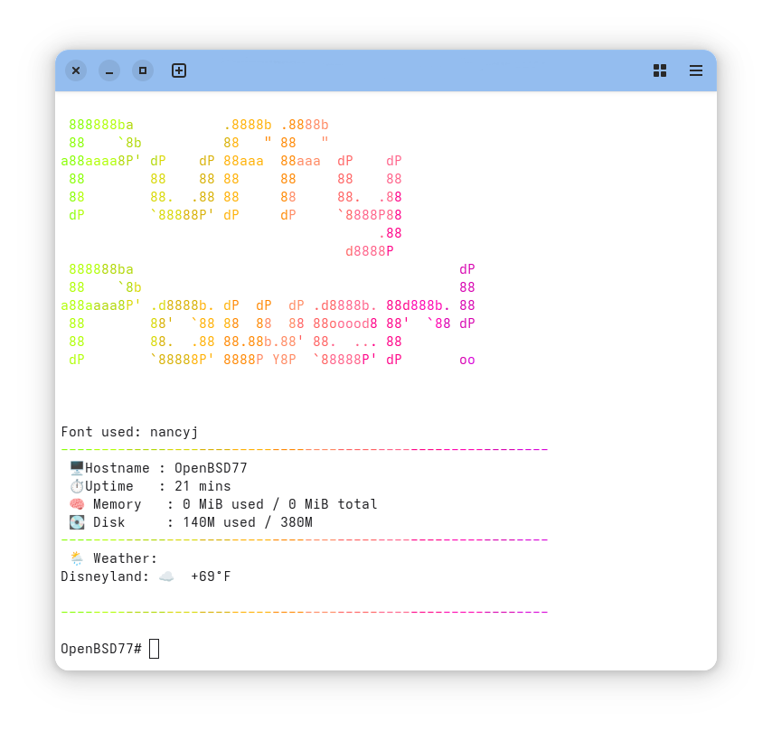

# 🐡 OpenBSD Dynamic Message of the Day Customizer

[](https://www.openbsd.org/)  [](#installation)  [](LICENSE)  

This project provides an **installer and setup helper** for a dynamic Message of the Day (MOTD) on **OpenBSD**.  
It automates setup for user or system-wide MOTD, handles dependencies, sets up [`figlet`](www.figtlet.com) fonts, enables colorful output, and integrates live weather reports, all dynamically run at each login. This is a standalone installer inspired by [`dynamic_motd`](https://github.com/sstallion/dynamic_motd) for FreeBSD. 

📝 Note that FreeBSD and OpenBSD handle MOTD differently - for the FreeBSD version please see: []([https://www.freebsd.org/](https://github.com/kevinlearnscoding/FreeBSD_dynamic_MOTD_installer))


<div align="center">
  
</div>

<div align="center">
  
</div>

---

## ✨ Features

- Installer for a **dynamic MOTD** specifically built for OpenBSD 🐡
- 🪧 **Custom banner text** displayed in a rotating set of [`figlet`](www.figlet.org) fonts  
- 🌈 **Colorful output** using [`lolcat`](https://github.com/jaseg/lolcat)  
- 📊 **System stats at a glance**:  
  - 🖥️ Hostname  
  - ⏱️ Uptime  
  - 🧠 Memory usage  
  - 💽 Root filesystem disk usage  
- 🌦️ **Live weather** from [wttr.in](https://wttr.in)  
- 🫵 **User choice**: system-wide or per-user MOTD  
- 📦 **Automatic handling of missing packages** ([`figlet`](www.figlet.org), [`curl`](https://github.com/curl/curl), [`lolcat-c`](https://github.com/jaseg/lolcat))  
- ⛓️‍💥 **Failsafe behavior** if a required tool is missing  

---

## ⚡ Quick Start

You can install this installer in **two ways**:

### Option 1️⃣: Fetch and Run Directly with SU or root privliges

```sh
ftp -o - https://raw.githubusercontent.com/kevinlearnscoding/OpenBSD-MOTD-Customizer/refs/heads/main/OpenBSD_MOTD.sh | sh
```

### Option 2️⃣: Download, Inspect, and Run

```sh
ftp -o OpenBSD_MOTD.sh https://raw.githubusercontent.com/kevinlearnscoding/OpenBSD-MOTD-Customizer/refs/heads/main/OpenBSD_MOTD.sh
chmod +x OpenBSD_MOTD.sh
./OpenBSD_MOTD.sh
```

This allows you to review or modify the script before execution.

---

## ⚠️ Requirements & Notes

- OpenBSD 7.0 or later  
- Dependencies managed by the script:  
  - [`figlet`](www.figtlet.com)  
  - [`curl`](https://github.com/curl/curl)
  - [`lolcat-c`](https://github.com/jaseg/lolcat) (will attempt to build from source if missing; requires [`git`](https://git-scm.com/))  
- Unicode support recommended for emojis in MOTD  
- Can run **system-wide** (`/etc/motd`) or **per-user** (`~/.motd`)  

⚠️ **Note on lolcat-c**: The script can either guide you to build manually or build automatically using [`git`](https://git-scm.com/) and `make`. Ensure you have [`git`](https://git-scm.com/) installed if using the automatic option.

---

## 🛠️ What the Installer Does

1. **Prompts for configuration**:
   - MOTD scope: system-wide or per-user  
   - Banner text  
   - Weather location  
   - Temperature units (F/C)

2. **Handles dependencies**:
   - Builds [`lolcat-c`](https://github.com/jaseg/lolcat) if missing  
   - Installs missing commands via `pkg_add` ([`figlet`](www.figtlet.com), [`curl`](https://github.com/curl/curl))  

3. **Creates a dynamic MOTD script** at:
   - System-wide: `/usr/local/bin/rc.motd_openbsd`  
   - User-only: `~/.motd_openbsd`  

4. **Ensures script runs at login** by adding it to:
   - `/etc/profile` (system-wide)  
   - `~/.profile` (user)

5. **Backs up the original MOTD** to `.motd.backup`

---

## 🖼️ Example Output (without color because GitHub filters it out! 👎)

```text
   .oooooo.                                    oooooooooo.   .oooooo..o oooooooooo.   
 d8P'  `Y8b                                   `888'   `Y8b d8P'    `Y8 `888'   `Y8b  
888      888 oo.ooooo.   .ooooo.  ooo. .oo.    888     888 Y88bo.       888      888 
888      888  888' `88b d88' `88b `888P"Y88b   888oooo888'  `"Y8888o.   888      888 
888      888  888   888 888ooo888  888   888   888    `88b      `"Y88b  888      888 
`88b    d88'  888   888 888    .o  888   888   888    .88P oo     .d8P  888     d88' 
 `Y8bood8P'   888bod8P' `Y8bod8P' o888o o888o o888bood8P'  8""88888P'  o888bood8P'   
              888                                                                    
             o888o                                 

Font used: roman
------------------------------------------------------------
 🖥️  Hostname : openbsd-testbox
 ⏱️  Uptime   : 2 days
 🧠 Memory    : 1024 MiB used / 4096 MiB total
 💽 Disk      : 8G used / 32G

------------------------------------------------------------
 🌦️  Weather:
 New York: 🌤️ +20°C
------------------------------------------------------------
```

---

## 📂 Configuration

After installation, edit the MOTD script to adjust:

```
/usr/local/bin/rc.motd_openbsd  # system-wide
~/.motd_openbsd                  # user-only
```

- Change banner text  
- Adjust fonts or font rotation  
- Modify weather URL or other display settings  
- Edit system stats output

Changes take effect immediately at next login.

---

## 🙌 Contributing

- Contributions to this installer are welcome  
- The underlying concept is inspired by [`dynamic_motd`](https://github.com/sstallion/dynamic_motd) for FreeBSD.  
- For improvements to the MOTD functionality itself, see upstream projects like [`dynamic_motd`](https://github.com/sstallion/dynamic_motd).

---

## 📜 License

This project is an **installer only** for OpenBSD.  
It is distributed under the **BSD 2-Clause License**. The [`figlet`](www.figtlet.com), [`lolcat-c`](https://github.com/jaseg/lolcat), [`curl`](https://github.com/curl/curl), and [`git`](https://git-scm.com/) projects each have their own respective licenses. 

All credit for MOTD logic and original concept belongs to [sstallion](https://github.com/sstallion) and contributors to [`dynamic_motd`](https://github.com/sstallion/dynamic_motd).  
